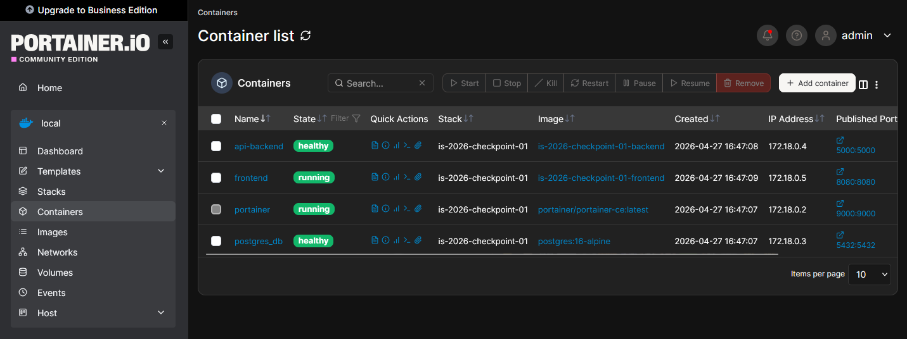

# is-2026-checkpoint-01
Trabajo practico grupal para la materia ingenieria de software - UTN FRLP - 2026

## Integrantes

| Integrante               | Feature(s)              |
|--------------------------|------------------------|
| Ruaro Francina           | Feature 01             |
| Pierrard Facundo         | Feature 02             |
| Ardenghi Ernesto Helvio  | Feature 03             |
| Huari Cesar Antonio      | Feature 04, Feature 05 |

## Arquitectura

- **frontend** → interfaz web 
- **backend** → API REST desarrollada en Flask  
- **database** → base de datos PostgreSQL (`postgres:16-alpine`)  


## Tecnologías utilizadas

- Python 3.12-slim
- Flask
- PostgreSQL 16-alpine
- Docker
- Docker Compose


## Configuración del proyecto
Copiar el archivo .env.example a .env y completar las variables con los valores deseados.  

Luego ejecutar:
```docker compose up -d --build```


## Panel de Monitoreo: Portainer
- **Acceso**: `http://localhost:9000`
- **Usuario**: El que crees en el primer inicio
- **Función**: Interfaz web para ver, reiniciar y monitorear los contenedores del proyecto sin usar terminal.
- **Persistencia**: Configuración guardada en el volumen nombrado `portainer_data`.
- **Socket**: Monta `/var/run/docker.sock` para comunicarse directamente con el daemon de Docker.


